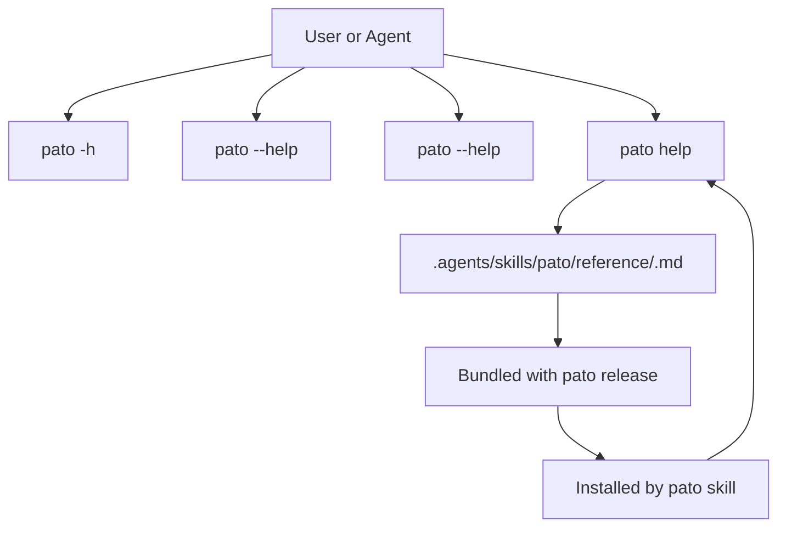

# Feature Proposal: `pato` Self-Documentation and Topic Help

**Status:** Draft — for review and iteration  
**Scope:** CLI help surface, topic-based help, and skill documentation packaging  
**Crate name:** `relateby-pato` (published), binary name: `pato`  
**Location:** `crates/pato/`, `.agents/skills/pato/`, and `proposals/`

---

## 1. Purpose

`pato` already helps developers and coding agents inspect, lint, format, parse, and
explain gram files. This proposal makes that knowledge easier to discover by turning
`pato` into its own documentation source.

The goal is to give users three progressively richer ways to ask for help:

1. `pato -h` for terse command discovery
2. `pato --help` / `pato <command> --help` for normal CLI usage
3. `pato help <topic>` for focused, prompt-optimized guidance on gram concepts and
   workflows

The important design constraint is that topic help should not drift from installed
skill documentation. Each help topic must correspond 1:1 with a markdown file at:

```text
.agents/skills/pato/reference/<topic>.md
```

That means the same markdown content is:

- authored in this repository
- bundled with `pato` for distribution
- installed onto end-user systems during `pato skill`
- rendered by `pato help <topic>`

---

## 2. Design Principles

**Single source of truth.** Topic docs should be written once and reused everywhere:
CLI help, packaged skill assets, and installed reference docs.

**Progressive disclosure.** The top-level help should stay terse. Deeper usage and
topic-specific guidance should be available only when requested.

**Prompt-optimized content.** Topic docs should be written so both humans and LLMs can
use them directly: short definition, semantics, caveats, and a few-shot examples.

**Stable topic names.** The `help` subcommand should treat topic names as part of the
public contract. A topic name should map directly to a file name.

**No documentation drift.** The installed skill tree should be a generated artifact,
not a manually maintained copy.

---

## 3. Proposed User Experience

### 3.1 Terse discovery

`pato -h` should be compact, like `rg -h`, and optimized for fast scanning:

```text
pato [OPTIONS] <COMMAND>

Commands:
  lint
  fmt
  parse
  rule
  check
  skill
  help
```

### 3.2 Standard CLI help

`pato --help` and `pato <command> --help` should provide the normal clap-style usage
with short explanations, arguments, flags, and examples.

### 3.3 Topic help

`pato help gram-annotation` should read the markdown topic file and present a focused
explanation:

- what the concept is
- when to use it
- the relevant syntax or semantics
- common pitfalls
- a few short examples

Example topics might include:

- `gram-annotation`
- `gram-notation`
- `skill-installation`
- `stdout-stderr-contracts`

The topic help output should be optimized for copy/paste and for use in prompts.



---

## 4. Topic File Model

Each topic is represented by a markdown file in the skill reference tree:

```text
.agents/skills/pato/
├── SKILL.md
└── reference/
    ├── gram-annotation.md
    ├── gram-notation.md
    ├── skill-installation.md
    └── stdout-stderr-contracts.md
```

The proposal is that this directory is the canonical documentation corpus for both the
CLI and the installed skill.

Recommended topic file shape:

- `# Topic Name`
- one-paragraph summary
- section for syntax or key concepts
- section for semantic rules or caveats
- section for examples
- optional section for related topics

The docs should be concise enough to be useful in `pato help`, but detailed enough to
serve as standalone reference material inside the installed skill tree.

---

## 5. `pato help <topic>` Command

Add a new built-in subcommand:

```text
pato help <topic>
```

### 5.1 Responsibilities

- Resolve the topic name to a reference markdown file
- Render that topic to stdout
- Return a non-zero error for unknown topics
- Keep output stable and readable for both humans and agents

### 5.2 Behavior

- If the topic exists, `pato help <topic>` prints the corresponding markdown content
  or a lightly formatted rendering of it.
- If the topic does not exist, `pato help` should explain available topics and how to
  discover them.
- The help surface should be deliberately predictable: the topic name maps directly to
  the file name.

### 5.3 Recommended initial topics

Start small and only add topics that are already proven useful:

- `gram-annotation`
- `gram-notation`
- `skill-installation`
- `stdout-stderr-contracts`

The exact initial set can be trimmed or expanded based on the docs that already exist
or are most needed by users.

---

## 6. Skill Packaging and Installation

`pato skill` should install the full skill tree, including the reference markdown
files. This proposal keeps the package and the installed result aligned by making the
reference files part of the bundled skill artifact.

Proposed install flow:

1. The repository contains the canonical skill tree and reference markdown files.
2. The `pato` build/package process bundles that tree into the release artifact.
3. `pato skill` installs the tree into `.agents/skills/pato/`.
4. The resulting install includes `reference/<topic>.md` files that `pato help <topic>`
   can also read from the same content source.

This keeps the user-visible install tree and the CLI help corpus synchronized by
construction.

### 6.1 Why this matters

- Users can inspect the exact same material that the CLI exposes
- LLMs can be pointed to a single file path for a given topic
- Documentation updates happen once, not in parallel copies
- The skill installation becomes a generated artifact, which is easier to validate

---

## 7. Content Guidelines For Topic Docs

Topic docs should be written for fast consumption. A good topic doc should:

- define the concept in one sentence
- explain the semantics in plain language
- show what is valid, what is not, and why
- include 2-4 few-shot examples
- mention nearby commands or topics when relevant

Topic docs should avoid:

- broad tutorial prose
- duplicated command reference text
- long-winded philosophy
- unstable examples that are likely to change frequently

The intent is not a full manual. It is a set of focused, reusable reference topics.

---

## 8. CLI Integration

This proposal fits naturally into the existing `pato` command tree.

Likely touch points:

- `crates/pato/src/cli.rs` for the new `help` subcommand and help metadata
- `crates/pato/src/commands/` for `help` dispatch
- `crates/pato/src/skill_install/` if the install step needs to bundle reference docs
- `crates/pato/skill-package/pato/` or the existing skill source tree for the
  canonical markdown corpus

The key implementation rule is that `help` should not invent topic content. It should
read the same canonical files that are packaged into the skill tree.

---

## 9. Implementation Sketch

### Phase 1: Define the help corpus

- Pick the initial topic set
- Write the markdown files
- Make sure topic names and file names match exactly

### Phase 2: Add topic help

- Add `pato help <topic>`
- Resolve topic names to files
- Print content or a compact rendering
- Add unknown-topic handling

### Phase 3: Bundle and install reference docs

- Include the markdown corpus in the packaged `pato` artifact
- Update `pato skill` to install the reference directory
- Confirm the installed tree matches the bundled source

### Phase 4: Polish the help surface

- Improve `pato -h` and `--help` wording
- Add short examples to command help where useful
- Make topic names easy to discover from the CLI

### Phase 5: Test

- verify `pato help <topic>` reads the expected file
- verify unknown topics fail clearly
- verify `pato skill` installs the reference tree
- verify the bundled and installed topic sets match

---

## 10. Open Questions

**Q1 — Rendering mode.** Should `pato help <topic>` print raw markdown, or a lightly
formatted terminal rendering of the same source?

**Q2 — Topic discovery.** Should `pato help` with no topic list available topics, or
should that remain the job of `pato --help`?

**Q3 — Topic granularity.** Should the first version include only a few high-value
topics, or should it mirror the whole skill reference tree from day one?

**Q4 — Help text vs. reference text.** Should `pato <command> --help` remain clap-native
while topic docs stay markdown-only, or should some command help also be backed by the
same reference files?

---

## 11. Summary

The core idea is to make `pato` self-documenting without creating a second, drifting
documentation system. The repository’s markdown reference topics become the canonical
docs, `pato help <topic>` becomes the focused reader for those docs, and `pato skill`
installs the same corpus into `.agents/skills/pato/reference/` on user systems.

That gives `pato` a clear documentation ladder:

- fast discovery
- normal CLI usage
- topic-specific explanations with examples

and keeps all three layers aligned.
